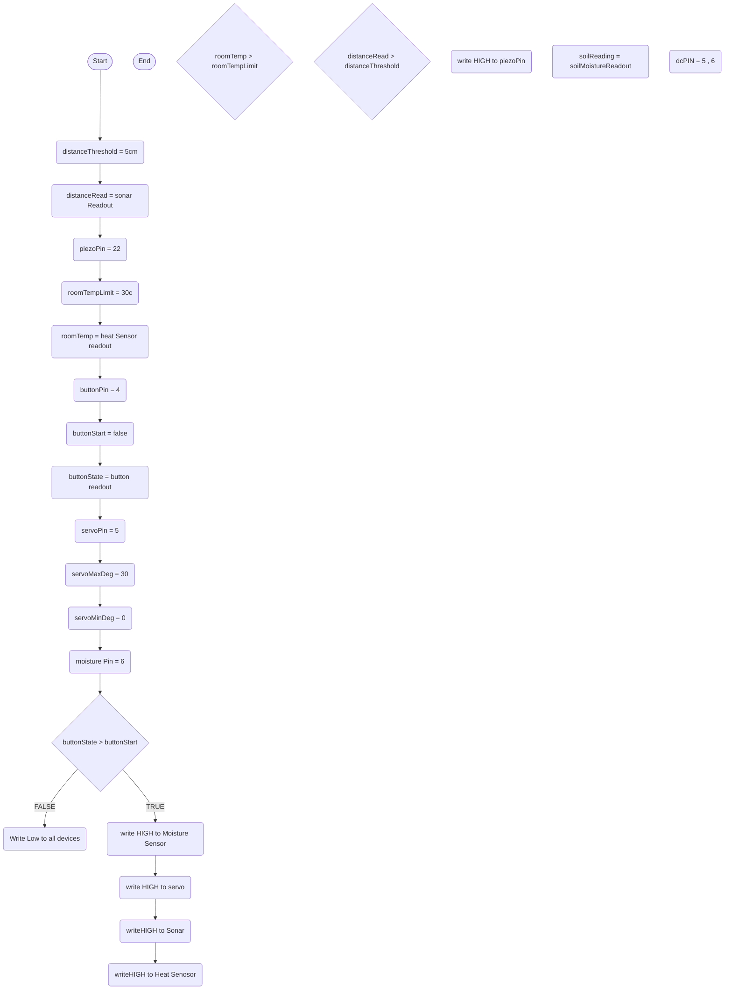
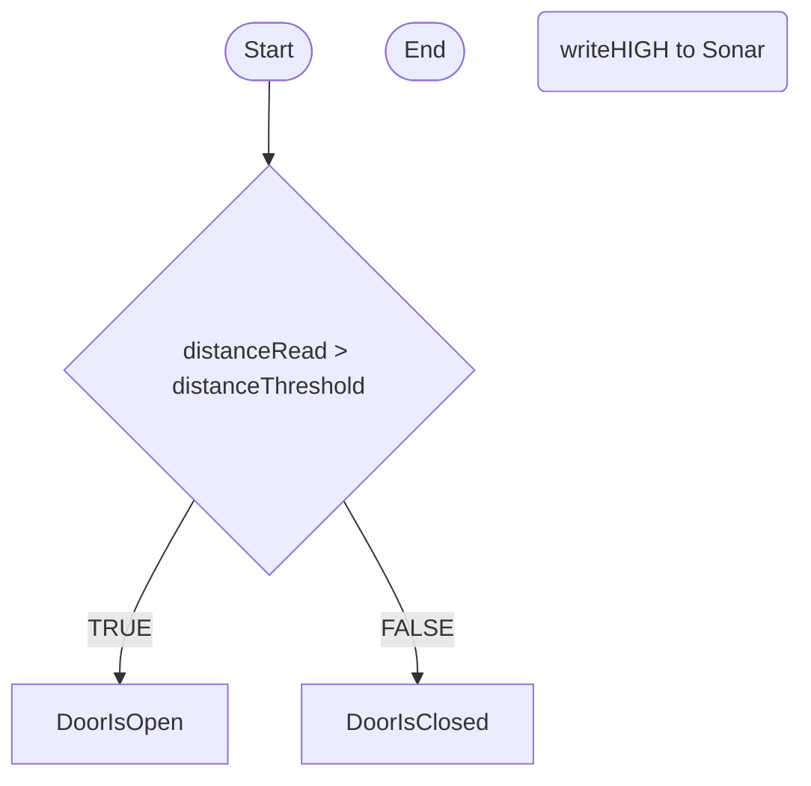
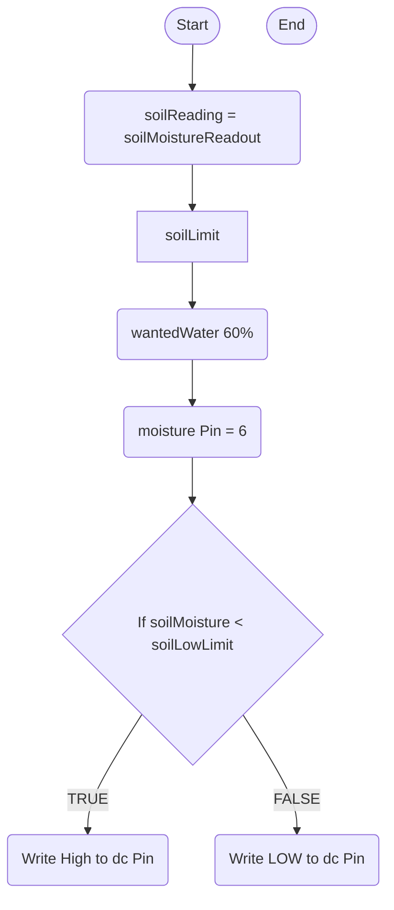
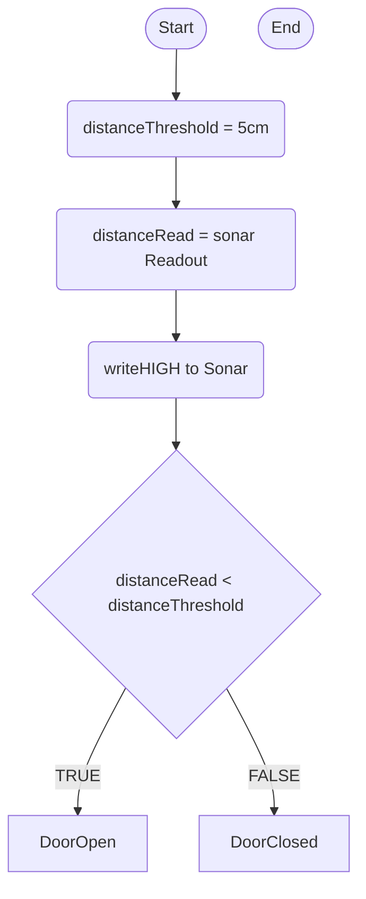
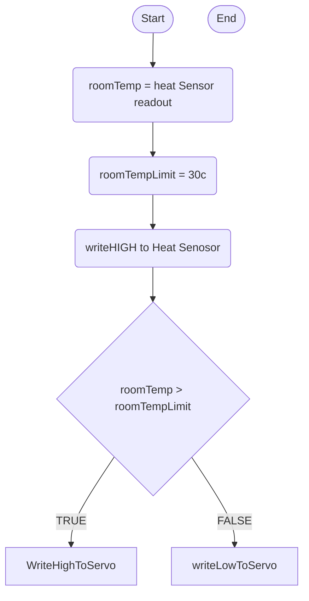
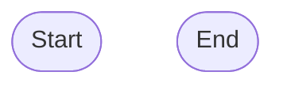

Flow chart about 


Temp flowchart
cc

%% Tempurture 
currentRoomTempReading(roomTemp = heat Sensor readout)
roomTempLimit(roomTempLimit = 30c)
ifTempGreaterThanLimit{roomTemp > roomTempLimit}
activateHeatSensor(writeHIGH to Heat Senosor)

%% servo
servoPin(servoPin = 5)


activateServo(write HIGH to servo)


terminalStart -->  roomTempLimit
roomTempLimit --> currentRoomTempReading
currentRoomTempReading --> activateHeatSensor
activateHeatSensor --> servoPin(servoPin = 5)
servoPin(servoPin = 5) --> ifTempGreaterThanLimit 
ifTempGreaterThanLimit -->  |TRUE| servoMax
ifTempGreaterThanLimit -->  |FALSE| servoMin
servoMax --> activateServo(write HIGH to servo)


```
Distance

Moisture Sensor 




