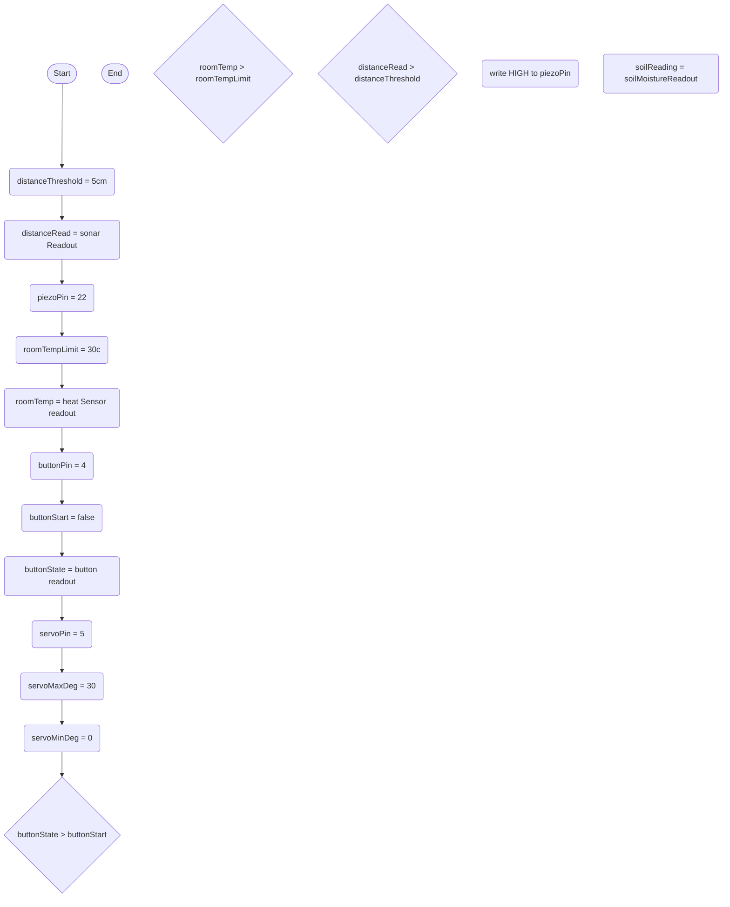

Flow chart about 

```mermaid
flowchart TD
terminalStart([Start])
terminalEnd([End])

%% Tempurture 
currentRoomTempReading(roomTemp = heat Sensor readout)
roomTempLimit(roomTempLimit = 30c)
ifTempGreaterThanLimit{roomTemp > roomTempLimit}


%% distance
thresholdSet(distanceThreshold = 5cm)
currentDistanceReading(distanceRead = sonar Readout)
ifDistanceLessThanThreshold{distanceRead > distanceThreshold}

%% peizo 
setPiezoPin(piezoPin = 22)
activatePiezo(write HIGH to piezoPin)

%% button
buttonStart(buttonStart = false)
setButtonPin(buttonPin = 4)
currentButtonReading( buttonState = button readout)
isButtonPressed{buttonState > buttonStart}


%% servo
servoPin(servoPin = 5)
servoMaxDeg(servoMaxDeg = 30)
servoMinDeg(servoMinDeg = 0)

%% soil moisture 
soilMoistureSensor(soilReading = soilMoistureReadout)


terminalStart --> thresholdSet
thresholdSet --> currentDistanceReading
currentDistanceReading --> setPiezoPin
setPiezoPin --> roomTempLimit
roomTempLimit--> currentRoomTempReading
currentRoomTempReading--> setButtonPin
setButtonPin --> buttonStart
buttonStart --> currentButtonReading
currentButtonReading --> servoPin
servoPin --> servoMaxDeg
servoMaxDeg --> servoMinDeg
servoMinDeg --> isButtonPressed


```